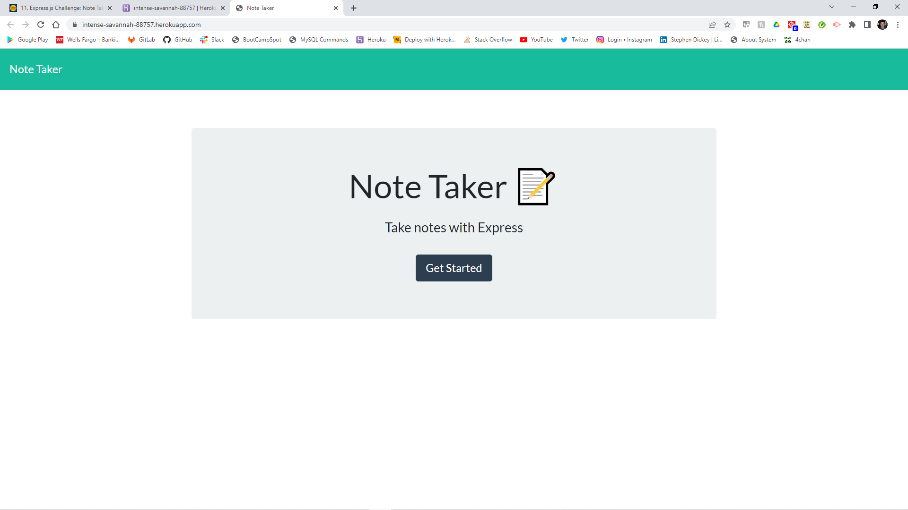
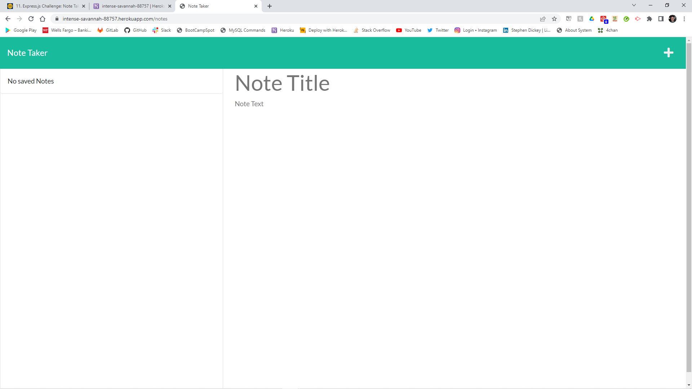
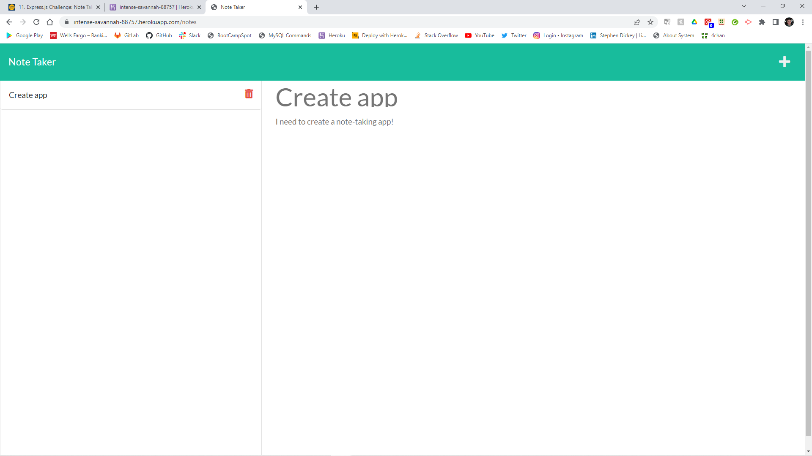

# Note Taker

## Description 

In this week's challenge we were tasked with using Node.js and Express.js to create a note taking app called Note Taker.

The created server features api endpoints, handles GET, POST, and DELETE requests, and also uses an npm module called uuid to generate unique id's for each note item on the site. The express server connects to front-end files to produce styling and html.

The application will be deployed to Heroku and can also be found on GitHub.

## Credits

Stephen Dickey - the author of this project(me).
GitHub page: https://github.com/StephenWDickey

Marcelo Gachet - Coding Bootcamp Instructor

Joseph Jepson - Coding Bootcamp tutor